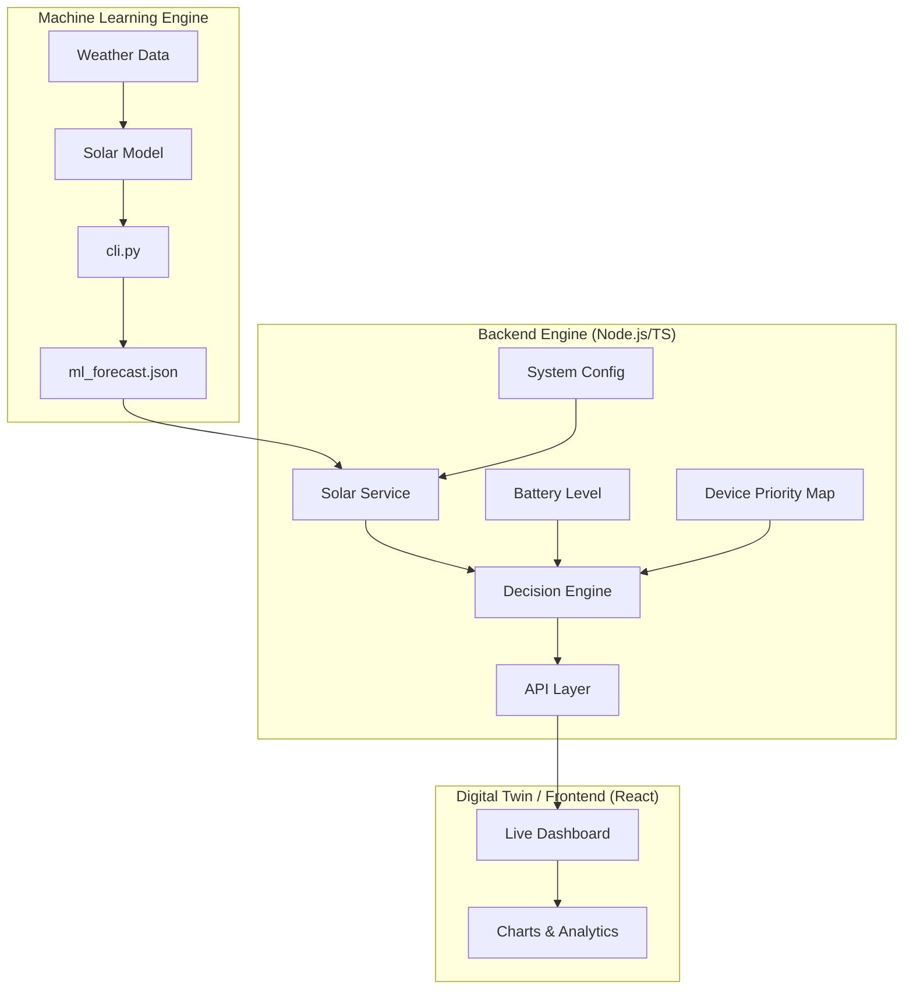

# ☀️ Solar-Scheduler: The Intelligent Brain for Off-Grid Living
[](https://opensource.org/licenses/MIT)
[](https://nodejs.org/)
[](https://www.python.org/)

**Predict. Prioritize. Power Up.**  
Solar-Scheduler is an AI-driven decision engine that transforms "dumb" solar installations into smart, adaptive energy ecosystems. By predicting solar yield and dynamically managing power loads, it ensures your critical devices stay on while maximizing the use of every single Watt-hour.

---

## 🚀 The Vision

Traditional off-grid systems are reactive. They wait for a battery to die before cutting loads. **Solar-Scheduler is proactive.** 

By analyzing historical data and forecasting weather-based solar potential, our system calculates "Energy Availability Windows." It then orchestrates your home's appliances (Critical vs. Flexible vs. Optional) to ensure a seamless power experience without manual intervention.

---

## ✨ Key Features

-   🧠 **ML-Powered Yield Forecasting**: Predicts solar generation for the next 15-minute window with high accuracy.
-   ⚖️ **Smart Load Prioritization**: Categorizes devices into **Critical**, **Flexible**, and **Optional** tiers.
-   🛡️ **Survival Mode**: Intelligent battery protection that prevents deep discharge by shedding non-essential loads.
-   🖥️ **Real-Time Dashboard**: A stunning, responsive UI for monitoring energy flows and system status.
-   ⚙️ **Hardware Agnostic**: Fully configurable to support various panel capacities and battery sizes.

---

## 🏗️ System Architecture

Our system is designed with a decoupled, modular architecture to ensure robustness and scalability.



---

## 🛠️ Tech Stack

-   **Backend**: Node.js, Express, TypeScript
-   **Frontend**: React (Vite), Tailwind CSS, Lucide Icons, Recharts
-   **ML_Engine**: Python, Pandas, ARIMA(for forecasting )
-   **Communication**: JSON-based inter-process communication

---

## 🚦 Getting Started

### Prerequisites

-   **Node.js** v18 or higher
-   **Python** 3.9 or higher

### 1. Setup ML Engine
```bash
cd ML_Engine
pip install -r requirements.txt
python cli.py --weather sunny  # Generate initial forecast
```

### 2. Setup Backend
```bash
cd Backend
npm install
npm run dev
```

### 3. Setup Frontend
```bash
cd frontend
npm install
npm run dev
```

The dashboard will be available at `http://localhost:5173`.

---

## 📁 Directory Structure

```text
Solar-Scheduler/
├── ML_Engine/          # Python forecasting model & CLI
├── Backend/            # Node.js Decision Engine & API
├── frontend/           # React dashboard UI
└── data/               # Historical solar/load datasets

```

---

## 🛠 Project Configuration

The system math adapts to your specific hardware. Configure these in the backend or via the dashboard:

| Parameter | Default | Description |
| :--- | :--- | :--- |
| `panelCapacityKw` | 3.0 kW | Peak output of your solar array |
| `batteryCapacityWh` | 5000 Wh | Total storage capacity |
| `efficiency` | 0.85 | Inverter and wiring loss factor |

---

## 🔮 Roadmap

-   [ ] **Grid Integration**: Optimization for hybrid grid/solar systems.
-   [ ] **Anomaly Detection**: Alerts for panel shading or battery degradation.
-   [ ] **Mobile App**: Native iOS/Android app for remote management.
-   [ ] **Edge Deployment**: Support for Raspberry Pi and ESP32 controllers.


---

### Developed for HackNagpur 2.0
Built with ❤️ by the CodeTailors Team.
